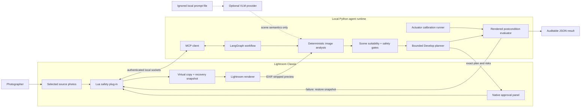

# StylePilot for Lightroom Classic

[](https://github.com/kotvaer/stylepilot/actions/workflows/ci.yml)
[](https://www.python.org/)
[](LICENSE)

StylePilot is a scene-aware Lightroom Classic editing agent. It decomposes a
reference photography style, checks whether the selected source photo is
compatible with that style, proposes safe global Develop adjustments, and
evaluates Lightroom's rendered result in a controlled feedback loop.

The product is deliberately Lightroom-first:

- Lightroom Classic remains the photo browser, editor, and renderer.
- A Lua plugin bridges Lightroom to a local Python agent runtime.
- LangGraph orchestrates deterministic analysis, model reasoning, safety
  checks, Lightroom tool calls, and user approval.
- The agent never modifies the original photo; edits target a virtual copy.

See [the product and technical design](docs/product-design.md) for the complete
scope and architecture.

## Architecture



The source photo is never an authorized write target. Python only authorizes
virtual copies created during the current session, while Lua independently
checks the Lightroom `isVirtualCopy` flag and numeric parameter ranges before
every write. Each mutation receives a recovery snapshot and a fresh rendered
postcondition check.

## Current milestone

M0, M1, the safety-critical M2 slice, the first M3 Style Profile slice, and the
M3.5 Lightroom actuator evaluator are complete:

- typed domain models and Develop-setting guardrails;
- a Lightroom bridge protocol and an in-memory test adapter;
- deterministic image-statistics, suitability, and baseline edit services;
- a LangGraph workflow covering selection, analysis, suitability routing,
  planning, virtual-copy creation, and application;
- a local CLI demo and automated tests;
- an MCP client that runs the checked-out StylePilot fork locally;
- real selected-photo, metadata, and Lightroom-rendered preview adapters;
- a connection doctor and a read-only Lightroom analysis command;
- a guarded `create_virtual_copy` tool and real apply workflow; and
- bridge-level authorization that rejects writes to any photo not created as a
  virtual copy during the current workflow session;
- a uniquely named Develop Snapshot before every write, automatic compensating
  rollback on failure, and an explicit cross-process recovery command; and
- a StylePilot-only Lua write path that independently verifies the target is a
  virtual copy and enforces numeric parameter ranges;
- a native request-bound Lightroom review panel that shows suitability,
  proposed settings, and risks before accepting or rejecting each write; and
- a Lightroom re-rendered postcondition check that measures clipping and style
  distance, automatically restoring the Snapshot on failure.
- robust multi-reference Style Profiles built from 5–20 rendered images;
- Lab color axes, luminance contrast, clipping distribution, robust dispersion,
  and review-only outlier diagnostics; and
- profile JSON loading in the real Lightroom inspect workflow, with the richer
  features included in suitability and postcondition distance.
- a typed scene taxonomy, optional OpenAI Responses vision adapter, and a
  deterministic semantic compatibility gate that fails closed before planning.
- a bounded multi-photo actuator calibration manifest, one-time native scope
  approval, repeated baseline renders, multi-point response measurement, and
  per-point automatic restoration; and
- versioned calibration reports that keep readback conformance, rendered
  response, baseline repeatability, and restoration drift independently visible.

The Lightroom integration is a credited fork of
[`Automaat/lightroom-mcp`](https://github.com/Automaat/lightroom-mcp) at
[`kotvaer/lightroom-mcp`](https://github.com/kotvaer/lightroom-mcp). It retains
the upstream socket lifecycle while adding StylePilot-specific tools. See
[Lightroom setup](docs/lightroom-setup.md) for build, installation, and safety
details.

## Development

Requirements: Python 3.12+ and [uv](https://docs.astral.sh/uv/).

```bash
uv sync
uv run ruff check .
uv run ruff format --check .
uv run ty check
uv run pytest
```

Run the local image demo without Lightroom:

```bash
uv run stylepilot demo /absolute/path/to/photo.jpg
```

Build a local Style Profile from a directory containing 5–20 rendered references:

```bash
uv run stylepilot style build \
  --name "Dearie Studio" \
  --preferred-scene portrait \
  --output .stylepilot/profiles/dearie-studio.json \
  /absolute/path/to/references
```

Possible outliers remain in the result and are never silently removed. Review
the reported image, curate the reference set explicitly, and rebuild when
necessary.

Use `--apply` to exercise the virtual-copy and apply branch against the
in-memory Lightroom adapter.

Check the real MCP and plugin connection:

```bash
uv run stylepilot lightroom doctor
```

Analyze Lightroom's primary selected photo without modifying it:

```bash
uv run stylepilot lightroom inspect
```

Analyze it against a built multi-reference profile:

```bash
uv run stylepilot lightroom inspect \
  --profile .stylepilot/profiles/dearie-studio.json
```

The current global-feature profile does not yet classify scene semantics. A
profile with preferred scenes now fails closed when source-scene semantics are
missing, low-confidence, or incompatible. Copy the safe template and put your
local API key in the ignored `.env` file:

```bash
cp .env.example .env
# Edit STYLEPILOT_VLM_API_KEY in .env, then run:

uv run stylepilot lightroom inspect \
  --profile .stylepilot/profiles/dearie-studio.json
```

`.env` can configure `STYLEPILOT_SEMANTIC_PROVIDER`, `STYLEPILOT_VLM_API_KEY`,
`STYLEPILOT_VLM_MODEL`, `STYLEPILOT_VLM_API_MODE`, and `STYLEPILOT_VLM_BASE_URL`.
Real process environment variables override `.env`; `OPENAI_API_KEY` is also
recognized as a key fallback. CLI options override provider, model, API mode,
and base URL. The default scene model is `gpt-5.6-luna`. Use `--env-file
path/to/file` to select a different dotenv file.
The adapter strips EXIF, converts the Lightroom preview to JPEG, limits the
long edge to 1024px, and requests low-detail structured scene output. API keys
are deliberately not accepted as CLI arguments.

Prompt text is deliberately not distributed in this repository. Put the
private scene prompt in an ignored local JSON file with the fields
`prompt_version`, `system_prompt`, and `user_prompt`, then set
`STYLEPILOT_VLM_PROMPT_FILE` in `.env`. The default location is
`.stylepilot/prompts/scene-analysis.json`, which is excluded by `.gitignore`.

For Qianwen AI Platform's direct OpenAI-compatible API, use:

```dotenv
STYLEPILOT_SEMANTIC_PROVIDER=qianwen
STYLEPILOT_VLM_API_KEY="..."
STYLEPILOT_VLM_MODEL=qwen3.7-plus
STYLEPILOT_VLM_API_MODE=chat_completions
STYLEPILOT_VLM_BASE_URL=https://dashscope.aliyuncs.com/compatible-mode/v1
```

The Qianwen vision and structured-output documentation uses Chat Completions
for image input with Pydantic/JSON Schema parsing, so this preset deliberately
does not use the OpenAI Responses adapter path.

For deterministic diagnosis without a network call, `--scene-override
landscape` supplies an explicit scene. It is an evaluation/debugging mechanism,
not an automatic-classification substitute.

After installing the StylePilot fork, create a virtual copy and apply the
guarded plan:

```bash
uv run stylepilot lightroom inspect --apply-to-virtual-copy
```

The command opens **StylePilot — Review Operation** inside Lightroom Classic and
waits for that exact request to be approved or rejected. Approval continues to
the guarded virtual-copy write; rejection exits without creating a copy or
changing the catalog. The panel can also be reopened from **File → Plug-in
Extras → StylePilot — Open Review Panel**.

Bring Lightroom Classic to the foreground to review the floating panel. If no
decision arrives before the client deadline, the runtime calls
`cancel_stylepilot_approval`; the plugin marks the request `client_cancelled`
and closes the stale panel so it cannot block the next run.

The successful result includes `rendered_metrics` and a `verification` report.
Safety thresholds are style inputs and can be tightened from the CLI:

```bash
uv run stylepilot lightroom inspect \
  --max-shadow-clip-ratio 0.005 \
  --max-highlight-clip-ratio 0.005 \
  --apply-to-virtual-copy
```

If the Lightroom-rendered output exceeds a clipping threshold or materially
regresses the objective style distance, the command returns
`status: "rolled_back"` after restoring the recovery Snapshot.

Measure one point in Lightroom's guarded Develop response surface:

```bash
uv run stylepilot lightroom probe \
  --parameter Contrast2012 \
  --value 20
```

The command opens the native Lightroom approval panel, creates a probe virtual
copy only after approval, applies the single absolute value, records
Lightroom readback and rendered metric deltas, and restores its recovery
Snapshot. The restored copy remains visible for audit and manual cleanup. A
versioned JSON report is written below
`.stylepilot/evaluations/probes/`. See
[the evaluation design](docs/evaluation-design.md) for the metric and dataset
policy.

Run a bounded multi-photo response experiment from the checked-in manifest:

```bash
uv run stylepilot lightroom calibrate \
  --manifest examples/actuator-calibration.json
```

Select 1–20 representative source photos first (originals are recommended for
a clean benchmark). Lightroom shows the exact files,
parameter values, virtual-copy count, sample count, render count, and risks in
one native approval panel. After approval, StylePilot creates one calibration
virtual copy per selected photo, repeats unchanged renders to measure baseline
noise, and restores a recovery Snapshot after every sample. Versioned reports
are written below `.stylepilot/evaluations/calibrations/`.

The result includes `recovery_snapshot.photo_id` and
`recovery_snapshot.name`. Restore that exact recovery token later with:

```bash
uv run stylepilot lightroom rollback \
  --photo-id 38216 \
  --snapshot-name "StylePilot Before <token>"
```
